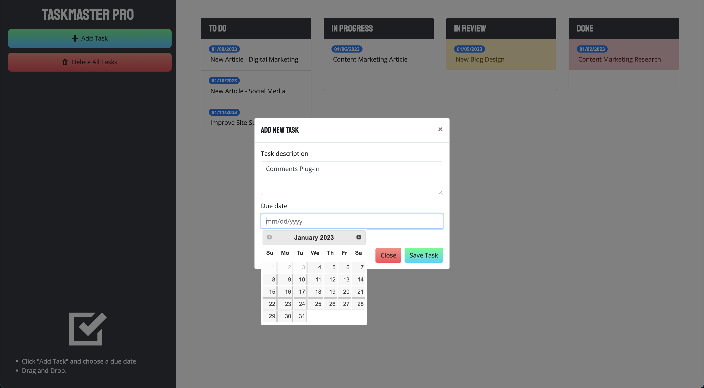
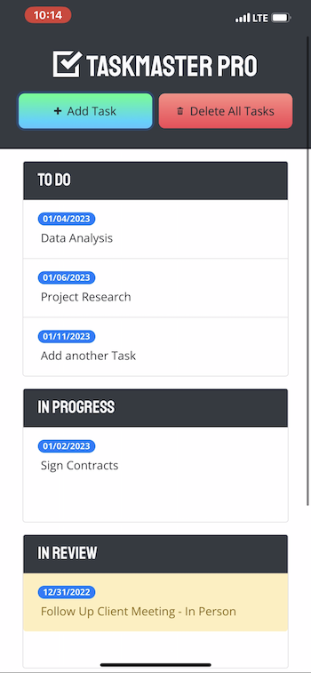

# Taskmaster Pro

## Description
Taskmaster Pro is a time management tool that enables users to create tasks with descriptive details and deadlines. The tasks are saved in and can be deleted from the browser's Local Storage. 

During my bootcamp, I was initially introduced to this project as a guided exercise. Through this project, I gained a deeper understanding of various UX/UI concepts, such as drag and drop functionality, responsive design, and data persistence. Later in the bootcamp, I learned about Progressive Web Applications and went back to this web app to make it a PWA, which can be used on mobile devices. The biggest challenge I faced in the project was fixing the service worker to function correctly on the browser, leading to the app being installable only on mobile phones (iPhone) but not on desktop computers.

## Table of Contents

- [Installation](#installation)
- [Usage](#usage)
- [Screenshot](#screenshot)
- [Video Tutorial](#video-tutorial)

## Installation

To use without installing, please navigate to the deployed site by [clicking this link](https://fdeaquino.github.io/taskmaster-pro/). 
To install on a mobile phone, such as an iPhone follow the steps below or watch [this video tutorial](https://drive.google.com/file/d/196OsR9x3Slc319OiUJagjtZgm-bJSv0r/view?usp=sharing):
1. Open Safari
1. Paste this url in the address bar --> https://fdeaquino.github.io/taskmaster-pro/ 
1. Tap the 'Share' icon 
1. Tap the 'Add To Home Screen' option
1. Tap 'Add'
1. Access the app from your home screen and enjoy the app!

## Usage

1. Start by clicking the 'Add Task' button
1. Type in a description and choose a 'Due Date'
1. Click the 'Save Task' button
1. Manage your task's status by dragging and dropping to the appropriate container
1. To delete a single task, drag it to the red 'Drop Here to Remove' container at the bottom of the screen
1. To delete all tasks click the 'Delete All Tasks' button

## Screenshot

## Video Tutorial
- [Desktop browser](https://drive.google.com/file/d/1aBh8lekqWMWg5w3Z6oFGRv9XkGY7zrKh/view?usp=sharing)
- [Mobile - Progressive Web Application](https://drive.google.com/file/d/196OsR9x3Slc319OiUJagjtZgm-bJSv0r/view?usp=sharing)